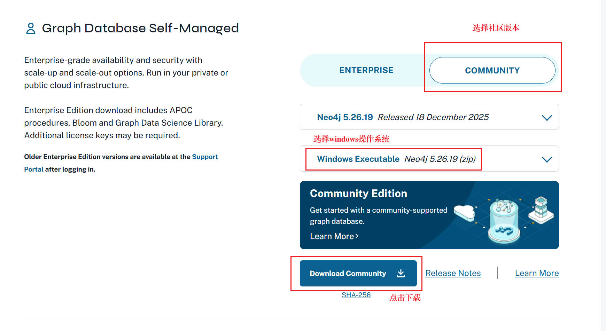
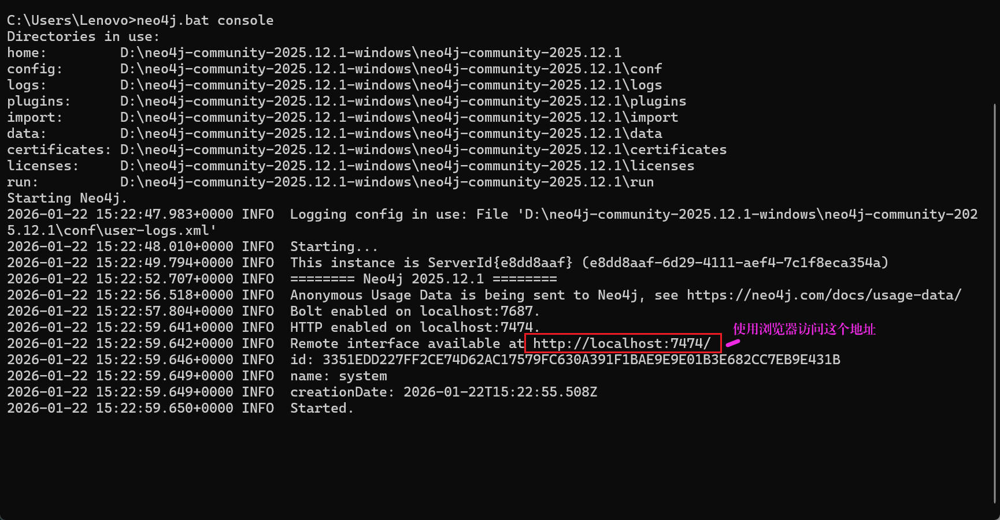
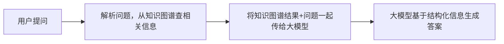

# neo4j 下载

参考博客：https://blog.csdn.net/vivian_ll/article/details/89312526

下载地址链接：https://neo4j.com/deployment-center/



下载完毕后，使用 `win + R` 打开命令行窗口，输入

```bash
    neo4j.bat console
```


 http://localhost:7474/


Windows PowerShell：变量赋值要加引号，且启动命令前无空格：
```bash
# 1. 先设置 API Key 环境变量
$env:DEEPSEEK_API_KEY="sk-你的实际APIKey"
# 2. 用 mvn 命令启动项目（替代 mvnw）
mvn spring-boot:run
```

>怎么调用ai大预言模型结合知识图谱生成答案

一、 核心流程

调用大语言模型（LLM）结合知识图谱生成答案，核心是让 LLM 基于知识图谱的结构化信息来输出更精准、可追溯的内容，通常分为「知识图谱查询」→「信息注入 LLM」→「LLM 生成答案」三个环节。以下是具体实现步骤（以你项目中的 Neo4j 知识图谱 + Deepseek 大模型为例）：



deepseek api接口使用查询官网：https://platform.deepseek.com/api_keys    


